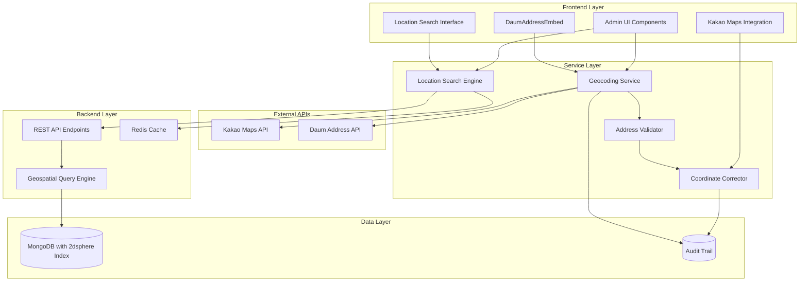

# Design Document: Address Registration with Geocoding and Location-Based Search

## Overview

This design document outlines the enhanced address registration system with automatic geocoding and location-based search functionality for the SpotLine admin system. The solution builds upon the existing DaumAddressEmbed component and Kakao Maps integration while adding robust geocoding reliability, location-based search capabilities, and comprehensive API documentation.

The system will maintain compatibility with existing store management workflows while providing enhanced location accuracy, search performance, and developer experience through comprehensive API documentation.

## Architecture

### High-Level Architecture



### Component Interaction Flow

1. **Address Input Flow**: User selects address via DaumAddressEmbed → Geocoding Service extracts coordinates → Address Validator normalizes data → Coordinate Corrector validates and stores
2. **Location Search Flow**: User initiates search → Location Search Engine queries cached/database → Geospatial Query Engine executes optimized queries → Results returned with pagination
3. **Error Handling Flow**: API failures → Fallback mechanisms → User notification → Audit logging

## Components and Interfaces

### 1. Enhanced Geocoding Service

**Purpose**: Reliable address-to-coordinate conversion with multiple fallback mechanisms

**Key Features**:
- Primary Kakao API integration with rate limiting
- Fallback geocoding methods for API failures
- Coordinate validation and accuracy scoring
- Batch processing capabilities for bulk operations

**Interface**:
```typescript
interface GeocodingService {
  geocodeAddress(address: string): Promise<GeocodingResult>
  batchGeocode(addresses: string[]): Promise<GeocodingResult[]>
  validateCoordinates(lat: number, lng: number): ValidationResult
  getGeocodingAccuracy(result: GeocodingResult): AccuracyScore
}

interface GeocodingResult {
  coordinates: { lat: number; lng: number }
  accuracy: 'high' | 'medium' | 'low'
  source: 'kakao' | 'fallback' | 'manual'
  confidence: number
  boundingBox?: BoundingBox
}
```

### 2. Location Search Engine

**Purpose**: High-performance proximity and area-based store search

**Key Features**:
- Radius-based search with configurable distance
- Area/region-based filtering
- Coordinate bounding box queries
- Result caching and pagination
- Performance optimization for large datasets

**Interface**:
```typescript
interface LocationSearchEngine {
  searchByRadius(center: Coordinates, radius: number, filters?: SearchFilters): Promise<SearchResult>
  searchByArea(area: string, filters?: SearchFilters): Promise<SearchResult>
  searchByBoundingBox(bounds: BoundingBox, filters?: SearchFilters): Promise<SearchResult>
  getNearbyStores(storeId: string, radius: number): Promise<Store[]>
}

interface SearchFilters {
  category?: string
  storeType?: 'operational' | 'demo' | 'all'
  isActive?: boolean
  tags?: string[]
  limit?: number
  offset?: number
}
```

### 3. Address Validator

**Purpose**: Robust validation and normalization of address data

**Key Features**:
- Address format normalization
- Korean address boundary validation
- Input sanitization for security
- Duplicate detection within proximity
- Field-level validation with specific error messages

**Interface**:
```typescript
interface AddressValidator {
  validateAddress(address: AddressInput): ValidationResult
  normalizeAddress(address: string): string
  sanitizeInput(input: string): string
  checkDuplicateProximity(coordinates: Coordinates, threshold: number): boolean
}

interface ValidationResult {
  isValid: boolean
  errors: ValidationError[]
  normalizedAddress?: string
  suggestions?: string[]
}
```

### 4. Coordinate Corrector

**Purpose**: Manual coordinate adjustment and accuracy management

**Key Features**:
- Interactive coordinate adjustment via map interface
- Source tracking for coordinate origins
- Accuracy validation and scoring
- Audit trail for manual corrections
- Real-time map preview updates

**Interface**:
```typescript
interface CoordinateCorrector {
  adjustCoordinates(storeId: string, newCoordinates: Coordinates, source: string): Promise<void>
  validateAccuracy(coordinates: Coordinates, address: string): AccuracyScore
  getCoordinateHistory(storeId: string): CoordinateHistory[]
  revertToOriginal(storeId: string): Promise<void>
}
```

## Data Models

### Enhanced Store Schema

```typescript
interface EnhancedStore {
  _id: string
  name: string
  category: string
  
  // Enhanced location data
  location: {
    address: string
    detailAddress?: string
    normalizedAddress: string
    coordinates: {
      type: "Point"
      coordinates: [number, number] // [lng, lat] for MongoDB 2dsphere
    }
    geocoding: {
      accuracy: 'high' | 'medium' | 'low'
      source: 'kakao' | 'fallback' | 'manual'
      confidence: number
      lastUpdated: Date
      originalSource?: string
    }
    area: string
    district?: string
    postalCode?: string
  }
  
  // Existing fields
  qrCode: {
    id: string
    isActive: boolean
  }
  isActive: boolean
  createdAt: Date
  updatedAt: Date
  
  // Search optimization
  searchKeywords: string[]
  locationTags: string[]
}
```

### Geospatial Index Configuration

```javascript
// MongoDB Index Configuration
db.stores.createIndex({ "location.coordinates": "2dsphere" })
db.stores.createIndex({ 
  "location.area": 1, 
  "category": 1, 
  "isActive": 1 
})
db.stores.createIndex({ 
  "searchKeywords": "text",
  "name": "text" 
})
```

### Location Search API Schema

```typescript
// Search Request Schema
interface LocationSearchRequest {
  // Radius search
  center?: { lat: number; lng: number }
  radius?: number // in meters
  
  // Area search
  area?: string
  
  // Bounding box search
  bounds?: {
    northeast: { lat: number; lng: number }
    southwest: { lat: number; lng: number }
  }
  
  // Filters
  category?: string
  storeType?: 'operational' | 'demo' | 'all'
  isActive?: boolean
  tags?: string[]
  
  // Pagination
  limit?: number
  offset?: number
  cursor?: string
}

// Search Response Schema
interface LocationSearchResponse {
  stores: StoreSearchResult[]
  pagination: {
    total: number
    limit: number
    offset: number
    hasMore: boolean
    nextCursor?: string
  }
  searchMetadata: {
    searchType: 'radius' | 'area' | 'bounds'
    executionTime: number
    cacheHit: boolean
  }
}

interface StoreSearchResult {
  _id: string
  name: string
  category: string
  location: {
    address: string
    coordinates: { lat: number; lng: number }
    area: string
  }
  distance?: number // in meters, for radius searches
  qrCode: { id: string; isActive: boolean }
  isActive: boolean
}
```

Now I need to use the prework tool to analyze the acceptance criteria before writing the correctness properties:

<function_calls>
<invoke name="prework">
<parameter name="featureName">address-geocoding-search

## Correctness Properties

*A property is a characteristic or behavior that should hold true across all valid executions of a system-essentially, a formal statement about what the system should do. Properties serve as the bridge between human-readable specifications and machine-verifiable correctness guarantees.*

Based on the prework analysis, I've identified the following properties that need to be tested to ensure system correctness. After reviewing all properties for redundancy, I've consolidated overlapping properties to ensure each provides unique validation value.

### Property Reflection

After analyzing all acceptance criteria, several properties were consolidated:
- Address validation properties (1.5, 7.4) were combined into a comprehensive validation property
- Coordinate boundary validation properties (1.3, 3.3, 7.2) were merged into a single boundary validation property  
- Error handling properties (1.2, 3.7) were combined into a comprehensive error response property
- Performance properties (4.1, 4.6) were consolidated into a single performance property
- Documentation properties (2.1-2.7, 6.1-6.7) were grouped into comprehensive documentation validation

### Core Geocoding Properties

**Property 1: Address Geocoding Accuracy**
*For any* valid Korean address, when processed by the Geocoding Service, the returned coordinates should be within Korean geographic boundaries and have a confidence score above 0.5
**Validates: Requirements 1.1, 1.3, 3.3, 7.2**

**Property 2: Geocoding Error Handling**
*For any* invalid address or API failure scenario, the Geocoding Service should return standardized error responses with clear messages and suggested corrections
**Validates: Requirements 1.2, 3.7**

**Property 3: Coordinate Source Tracking**
*For any* coordinate adjustment (manual or automatic), the system should preserve the source information and maintain an audit trail of all changes
**Validates: Requirements 1.4, 5.7**

**Property 4: Address Normalization Consistency**
*For any* address input in different formats representing the same location, the Address Validator should produce identical normalized addresses
**Validates: Requirements 1.6, 7.3**

**Property 5: Fallback Mechanism Reliability**
*For any* Kakao API failure, the Geocoding Service should automatically attempt fallback methods and continue to provide geocoding results
**Validates: Requirements 3.1**

### Location Search Properties

**Property 6: Radius Search Accuracy**
*For any* center point and radius, all returned stores should be within the specified distance, and no stores within the radius should be omitted
**Validates: Requirements 2.1, 4.1**

**Property 7: Search Performance Consistency**
*For any* search query under normal load conditions, the Location Search Engine should return results within 200ms and maintain performance under concurrent requests
**Validates: Requirements 4.1, 4.6**

**Property 8: Pagination Correctness**
*For any* search result set exceeding the page limit, cursor-based pagination should provide complete coverage without duplicates or omissions
**Validates: Requirements 4.3**

**Property 9: Cache Consistency**
*For any* frequently accessed area-based query, cached results should match fresh database queries and be invalidated when underlying data changes
**Validates: Requirements 4.4**

### Validation and Security Properties

**Property 10: Input Sanitization Security**
*For any* malicious input containing injection attempts, the Address Validator should sanitize the input and prevent security vulnerabilities
**Validates: Requirements 7.1**

**Property 11: Comprehensive Field Validation**
*For any* store creation attempt with missing or invalid required fields, the Address Validator should prevent creation and provide specific error messages for each invalid field
**Validates: Requirements 1.5, 7.4, 7.7**

**Property 12: Duplicate Detection Accuracy**
*For any* new store with coordinates within reasonable proximity of existing stores, the Address Validator should detect and flag potential duplicates
**Validates: Requirements 7.5**

**Property 13: URL Validation Correctness**
*For any* image URL or external link input, the Address Validator should verify format validity and accessibility
**Validates: Requirements 7.6**

### System Integration Properties

**Property 14: Backward Compatibility Preservation**
*For any* existing store data, integration of new location features should maintain full compatibility and preserve all existing functionality
**Validates: Requirements 8.1, 8.4**

**Property 15: Store Type Support Consistency**
*For any* operation (create, update, search), the system should handle both operational stores (real_ prefix) and demo stores (demo_ prefix) with identical functionality
**Validates: Requirements 8.2**

**Property 16: Data Migration Integrity**
*For any* existing store migrated to the enhanced location format, all original data should be preserved and QR code associations should remain intact
**Validates: Requirements 8.3, 8.6**

### UI and User Experience Properties

**Property 17: Real-time Map Updates**
*For any* coordinate adjustment in the UI, the map display should update immediately to reflect the new position
**Validates: Requirements 5.3**

**Property 18: Bulk Operation Consistency**
*For any* bulk address validation operation, each address should be processed with the same validation rules as individual operations
**Validates: Requirements 5.6**

### Rate Limiting and Performance Properties

**Property 19: Rate Limiting Enforcement**
*For any* sequence of API calls exceeding the configured rate limit, the Geocoding Service should enforce throttling and prevent quota exhaustion
**Validates: Requirements 3.4**

**Property 20: Error Logging Completeness**
*For any* geocoding failure or system error, appropriate log entries should be created with sufficient detail for monitoring and debugging
**Validates: Requirements 3.5**

## Error Handling

### Geocoding Error Scenarios

1. **Kakao API Failures**
   - Network timeouts: Implement exponential backoff with 3 retry attempts
   - Rate limit exceeded: Queue requests and implement throttling
   - Invalid API key: Log error and use fallback methods
   - Service unavailable: Switch to backup geocoding service

2. **Address Validation Errors**
   - Invalid format: Provide format suggestions and examples
   - Ambiguous addresses: Present multiple options for user selection
   - Out of bounds coordinates: Reject with clear boundary information
   - Missing required fields: Highlight specific missing fields

3. **Search Performance Issues**
   - Query timeout: Implement circuit breaker pattern
   - High load: Enable query throttling and result caching
   - Large result sets: Force pagination and limit result size
   - Index failures: Fallback to non-optimized queries with warnings

### Error Response Format

```typescript
interface ErrorResponse {
  success: false
  error: {
    code: string
    message: string
    details?: any
    suggestions?: string[]
    retryable: boolean
  }
  timestamp: string
  requestId: string
}
```

### Error Codes

- `GEOCODING_FAILED`: Address could not be geocoded
- `INVALID_COORDINATES`: Coordinates outside valid range
- `RATE_LIMIT_EXCEEDED`: API rate limit exceeded
- `VALIDATION_ERROR`: Input validation failed
- `DUPLICATE_DETECTED`: Potential duplicate store detected
- `SEARCH_TIMEOUT`: Search query timed out
- `CACHE_ERROR`: Cache operation failed

## Testing Strategy

### Dual Testing Approach

The system requires both unit testing and property-based testing for comprehensive coverage:

**Unit Tests**: Focus on specific examples, edge cases, and integration points
- Address format validation with known valid/invalid examples
- API error simulation and response handling
- UI component behavior with specific user interactions
- Database query correctness with sample data

**Property-Based Tests**: Verify universal properties across all inputs
- Generate random valid Korean addresses for geocoding accuracy testing
- Create random coordinate sets for boundary validation
- Generate various search parameters for performance testing
- Test with random malicious inputs for security validation

### Property-Based Testing Configuration

- **Testing Library**: Use `fast-check` for TypeScript/JavaScript property-based testing
- **Test Iterations**: Minimum 100 iterations per property test
- **Test Tagging**: Each property test must reference its design document property
- **Tag Format**: `Feature: address-geocoding-search, Property {number}: {property_text}`

### Test Categories

1. **Geocoding Accuracy Tests**
   - Property tests for coordinate extraction accuracy
   - Unit tests for specific address formats
   - Integration tests with Kakao API

2. **Search Performance Tests**
   - Property tests for response time consistency
   - Load tests for concurrent request handling
   - Unit tests for caching behavior

3. **Validation Security Tests**
   - Property tests for input sanitization
   - Unit tests for known injection patterns
   - Integration tests for validation workflows

4. **UI Integration Tests**
   - Unit tests for component interactions
   - Property tests for real-time updates
   - End-to-end tests for complete workflows

### Performance Testing Requirements

- Search queries under 10km radius: < 200ms response time
- Concurrent request handling: No degradation up to 100 concurrent users
- Cache hit ratio: > 80% for frequently accessed area queries
- Database query optimization: All location queries must use geospatial indexes

### API Documentation Testing

All generated API documentation must be validated for:
- OpenAPI 3.0 specification compliance
- Complete request/response schema coverage
- Accurate error code documentation
- Working example requests and responses
- Performance requirement specifications